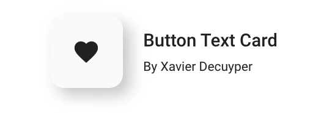
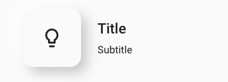
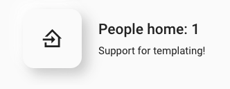

<p align="center">
  <a href="" rel="noopener">
 </a>
</p>

<h3 align="center">Button Text Card</h3>

<div align="center">
  
  [](https://github.com/custom-components/hacs)
  [](https://github.com/Savjee/button-text-card/actions?query=workflow%3ABuild)
  [](https://github.com/Savjee/button-text-card/issues)
  [](https://github.com/Savjee/button-text-card/pulls)
  [](/LICENSE)

</div>

---

Custom, "neumorphism" card for Home Assistant with support for templating.

# Install

1. Open HACS
2. Go to Settings > Custom Repository
3. Add `git@github.com:Savjee/button-text-card.git` as plugin
4. Install it
5. Add to your Lovelace config:

```yaml
  - url: /community_plugin/button-text-card/button-text-card.js
    type: module
```

# Examples

**Basic card with static title, subtitle and custom icon**
<div align="center">
    
</div>

```yaml
type: 'custom:button-text-card'
title: Title
subtitle: Subtitle
icon: 'mdi:lightbulb-outline'
```

**Only title**
<div align="center">
    
</div>

```yaml
type: 'custom:button-text-card'
title: Only title
icon: 'mdi:format-title'
```

**Support for templating**

You can use templates in title, subtitle and even for the icon: 
<div align="center">
    
</div>

```yaml
type: 'custom:button-text-card'
icon: >
   
    mdi:home-export-outline 
   
    mdi:home-import-outline 
  
title: >
  People home: 
    {{ states.person | selectattr('state', 'eq', 'home') | list | count | int }}
subtitle: Support for templating!
```